1.  Tomcat Manager in Azure Webapps (Windows)
    =========================================

    1.  Create Java Webapp by deploying a war file.
        -------------------------------------------

        1.  ### Install maven and Java

git clone <https://github.com/milindvb/mbjavahello.git>

cd mbjavahello

### build with maven (this will create a war file)

mvn clean package

### Create a new Webapp

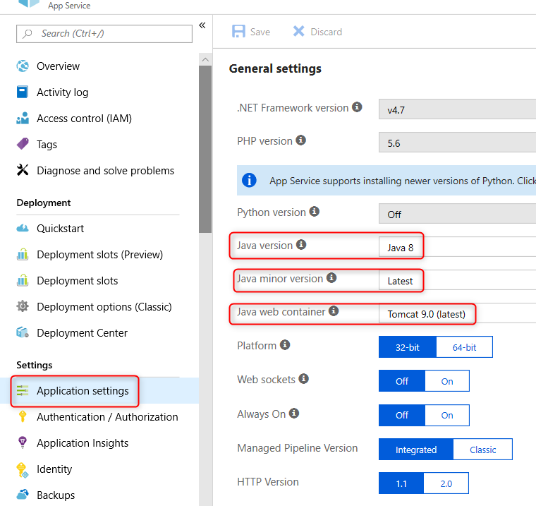

### Deploy the war file to Azure

Access Kudu console of the webapp: In Azure portal click on Advanced
Tools Go

Select “Cmd” from the top menu

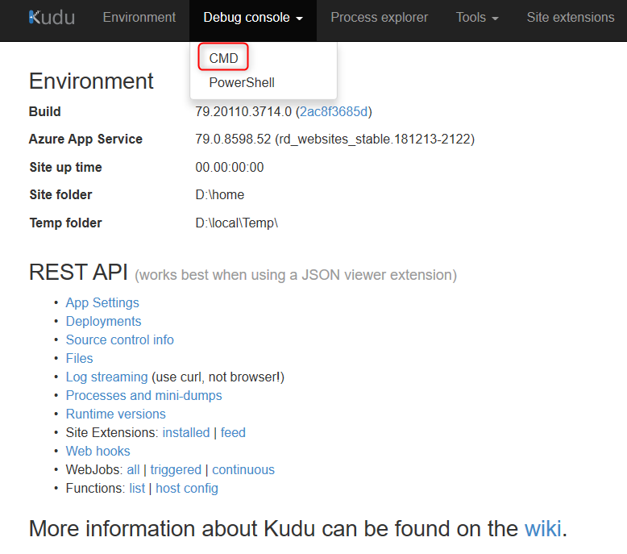

Navigate to D:\\home\\site\\wwwroot\\webapps folder

On your local machine, locate the warfile under the “target” folder.

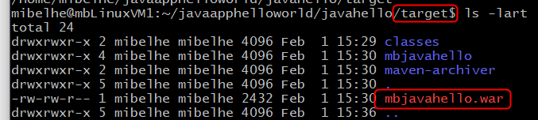

In windows, drag and drop the war file in
D:\\home\\site\\wwwroot\\webapps folder in the Kudu console.

Alternatively you can ftp the file to the same folder.

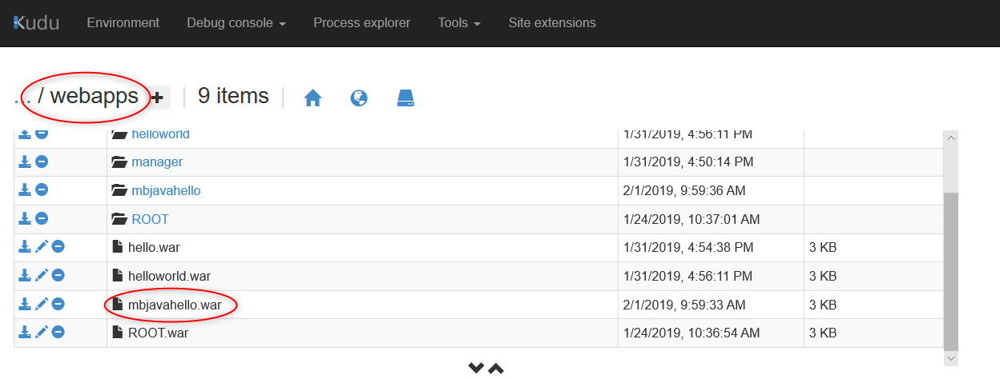

Navigate to &lt;azuresite&gt;/mbjavahello to see the webapp running.

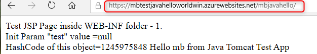

1.  Installing Tomcat Manager
    -------------------------

    1.  ### Create folder to host tomcat config files

In kudu console, navigate to D:\\home\\site\\wwwroot

Click on “+” sign and select New Folder

Create a new folder called “conf”

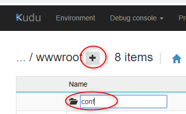

### Find the path to Tomcat

Open Kudu console

Click Process Explorer

Click Properties for the java process

Click on Handles tab

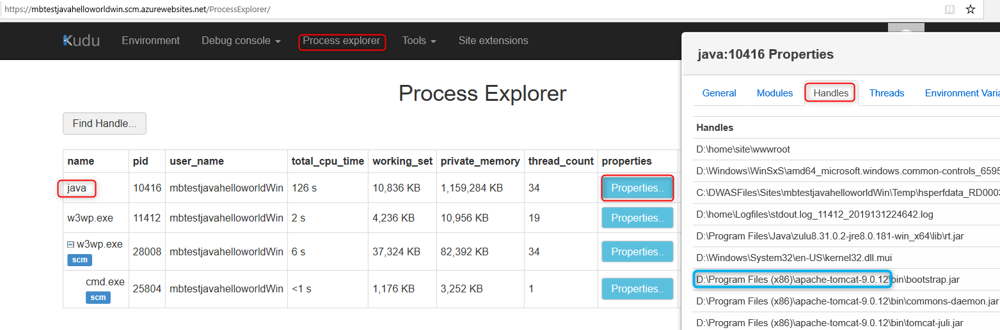

In this example, tomcat location is D:\\Program Files
(x86)\\apache-tomcat-9.0.12

### Copy Tomcat config files

Copy Tomcat server.xml and tomcat-users.xml from tomcat folder to the
conf folder created in earlier step

Commands used:

copy "D:\\Program Files (x86)\\apache-tomcat-9.0.12\\conf\\server.xml"
D:\\home\\site\\wwwroot\\conf\\

copy "D:\\Program Files
(x86)\\apache-tomcat-9.0.12\\conf\\tomcat-users.xml"
D:\\home\\site\\wwwroot\\conf\\

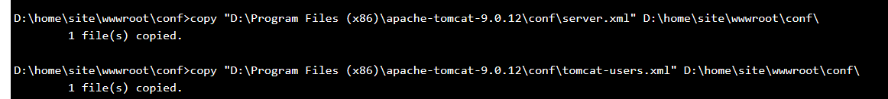
### Copy Tomcat Manager App to Webapps

Command used:

cp -r "D:\\Program Files (x86)\\apache-tomcat-9.0.12\\webapps\\manager"
D:\\home\\site\\wwwroot\\webapps

Example:

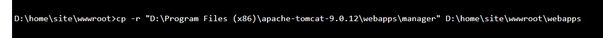

### Create web.config, Edit server.xml and tomcat-users.xml

Create new file web.config in /home/site/wwwroot folder with following
contents:

&lt;?xml version="1.0" encoding="UTF-8"?&gt;

&lt;configuration&gt;

&lt;system.webServer&gt;

&lt;security&gt;

     &lt;requestFiltering&gt;

        &lt;requestLimits maxAllowedContentLength="52428800"/&gt;

       &lt;/requestFiltering&gt;

    &lt;/security&gt;

&lt;handlers&gt;

&lt;remove name="httpPlatformHandlerMain" /&gt;

&lt;add name="httpPlatformHandlerMain" path="\*" verb="\*"
modules="httpPlatformHandler" resourceType="Unspecified"/&gt;

&lt;/handlers&gt;

&lt;httpPlatform processPath="D:\\Program Files
(x86)\\apache-tomcat-9.0.12\\bin\\startup.bat" arguments="-config
D:\\home\\site\\wwwroot\\conf\\server.xml" requestTimeout="00:04:00"
startupTimeLimit="60" startupRetryCount="3" stdoutLogEnabled="true"
stdoutLogFile="D:\\home\\Logfiles\\stdout.log"&gt;

&lt;environmentVariables&gt;

&lt;environmentVariable name="CATALINA\_OPTS" value="-Xms1024m -Xmx1024m
-Dport.http=%HTTP\_PLATFORM\_PORT% -Dsite.logdir=d:/home/LogFiles/"
/&gt;

&lt;/environmentVariables&gt;

&lt;/httpPlatform&gt;

&lt;/system.webServer&gt;

&lt;/configuration&gt;

Edit server.xml as follows:

Change pathname of tomcat-users.xml to point to the new file in conf
folder

pathname="D:\\home\\site\\wwwroot\\conf\\tomcat-users.xml" /&gt;

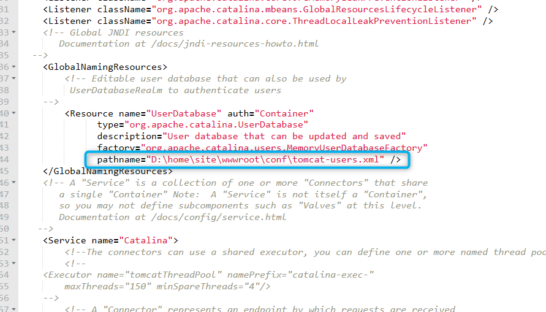

Edit tomcat-users.xml to create new role for manager-gui

Replace everything in tomcat-user.xml with following:

&lt;?xml version="1.0" encoding="UTF-8"?&gt;

&lt;tomcat-users

xmlns="http://tomcat.apache.org/xml"

xmlns:xsi="http://www.w3.org/2001/XMLSchema-instance"

xsi:schemaLocation="http://tomcat.apache.org/xml tomcat-users.xsd"

version="1.0"&gt;

&lt;role rolename="tomcat"/&gt;

&lt;role rolename="role1"/&gt;

&lt;role rolename="manager-gui"/&gt;

&lt;user username="tomcat" password="tomcat"
roles="tomcat,manager-gui"/&gt;

&lt;user username="both" password="tomcat" roles="tomcat,role1"/&gt;

&lt;user username="role1" password="tomcat" roles="role1"/&gt;

&lt;/tomcat-users&gt;

Access Tomcat Manager
---------------------

Restart the webapp from “Overview” pane in Azure portal.

Navigate to : &lt;appname&gt;.azurewebsites.net/manager to access the
manager console.

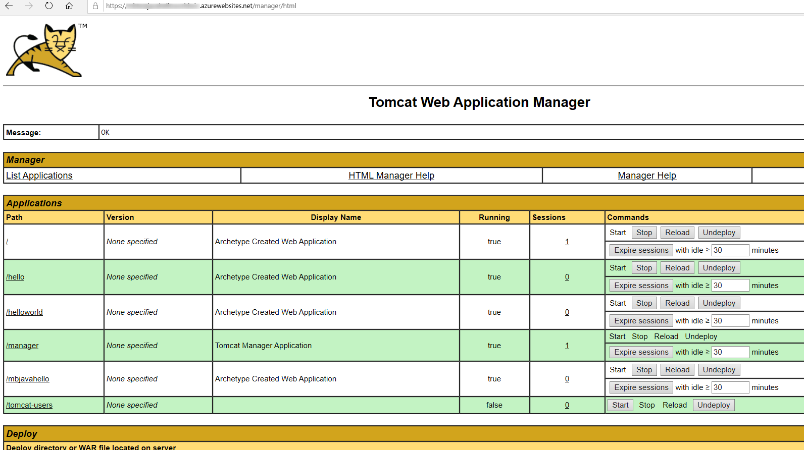

